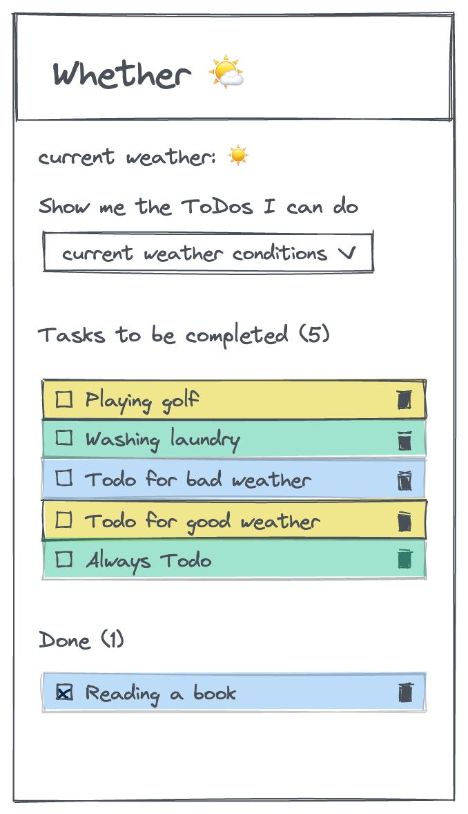

# Recap 4: ToDo App - Whether

In this recap project you are going to work in a group to create a ToDo App, which organizes your ToDos according to different weather conditions.

## Starter Code

You can find the
[starter template here](https://github.com/shebtastic/whether-template).
Create only one repository per group, but each member of the group clones the repository to their local machine.

> 💡 Don't forget to run `npm install` to install all necessary dependencies (e.g. styled-components).

> 💡 Don't forget to work on feature branches, otherwise you might run into merge conflicts!

## Tasks

### Render ToDo List

Your first task is to render ToDos in a list. For now you have only a few hardcoded ToDos in the `data.js` file. These ToDos are passed to the `todos` state in the `App` component as `initialTodos`.

- Create a `Todo` component for a single ToDo list item.
- In the `TodoList` component use an array method to render the `ToDo` component for each todo list item.
- Your `ToDoList` component should also include a heading with the name of the ToDo list and the amount of ToDos in the list.
- Add styling according to the provided wireframe. The `background-color` of the `Todo` component should correspond to the respective weather status. (e.g. a "good weather ToDo" should be yellow, a "bad weather ToDo" should be blue, an "always or any weather ToDo" should be green).

### Check ToDos

Now we want to be able to mark ToDos as completed. Additionally, all completed ToDos should be rendered in a separate list.

- Add a checkbox to the `Todo` component.
- Create a function `toggleCheckTodo` in the `App` component. The function should update the `todos` state, so that the `isChecked` property of the respective ToDo item is toggled.
  > 💡 This is an uplifted state, passed down through props.
- Make sure the function is called in the `Todo` component when the checkbox is checked.
  > 💡 This is a callback from the lifted state.
- Reuse the `TodoList` component to render a second ToDo list in the `App` with the title "Done".
- Adjust the ToDos you pass as a prop to both ToDoLists, so that the first list only shows the unfinished ToDos and the second one the completed ones.

### Fetch Weather Data & Filter ToDos

Now we can fetch the weather data from an API and implement a filter, so that the user can pick the appropriate ToDos for current weather conditions.

But first let's have a look at what happens in our `App` component:  
On initial render of the Whether App the function `determineCurrentWeather` inside the `useEffect` is called. This function first calls the function `getUserLocation` which determines the current location of the user (the user will receive a built-in browser notification asking for permission). After that the function `getWeatherData` will fetch the weather data for the specific coordinates of the user's location. The weather API returns a `weatherCode` which will be converted with the function `convertWeatherCodeToEmoji` and saved inside the state `weatherStatus`.

- Right now `getWeatherData` returns the weather code `0`, so the `Infobox` component always displays best weather conditions ☀️. Write the fetch to receive the weather code for the user's location inside the function `getWeatherData`. Use the following url for the fetch:

```js
`https://api.open-meteo.com/v1/forecast?latitude=${latitude}&longitude=${longitude}&current_weather=true`;
```

- 💡 Keep in mind that, after successfully fetching the weather data, the function `getWeatherData` should return _only the weather code_ which is a single number. Logging the fetched data to the console first, might help you to find the weather code in the object we fetched.

If you have done everything correctly, the `Infobox` should now show the current weather conditions of the user's location.
Now we need to implement the filter, so that the user can choose to only see ToDos for good, bad or any weather conditions.

- Uncomment the `SelectWeather` component in the `App` to render the filter element. When the user picks an option from the `select` element the corresponding ToDos should be shown in the ToDo list.
- The filter does not work properly yet. Have a look at the constant `filteredTodos` right above the return statement in the `App` component. You will need to adjust `filteredTodos`, so that the function `filterTodos` can do it's job. Keep in mind that you also need to adjust the ToDos you pass as a prop to your two ToDo lists.

### Add new ToDos

As a next step we want to enable the user to add new ToDos to the list.

- Add a `form` inside the `AddTodo` component. The form should include the following elements:
  - an input element for the ToDo text - this field should be required and accept a maximum length of 20 characters.
  - 3 radio buttons with the values "always", "good" and "bad", so the user can decide with which weather conditions the ToDo can be done - the option "always" should be selected by default
  - a submit button
  - a cancel button
- Render the `AddToDo` component in the `App`. You will see a floating button to open the modal with the form.
- Create a function `addTodo` in the `App` component. The function should add the new ToDo to the `todos` state. Keep in mind, that every new ToDo needs an id. You can generate an id with the npm package [nanoid](https://www.npmjs.com/package/nanoid).
  > 💡 Don't forget to install the package first.
- In the `AddTodo` component use this function and `FormData` on form submission to append the newly created ToDo to your `todos` state.
- After form submission the modal with the form should close automatically. Use `setTimeout` and the `isOpen` state in the submit function to close the modal shortly after submission.
- Adjust the cancel button, so that on click the modal will close directly.

> 💡 Have a look at the different variants of your `Button` component. You can use the different variants to add some styling to your buttons.

### Delete ToDos

Now we want to be able to delete ToDos.

- Add a "delete" button to the `Todo` component by using the already existing `Button` component.
- Create a function `deleteTodo` in the `App` component. The function should delete the ToDo with the respective ID from the `todos` state.
- Make sure the function is called in the `Todo` component when the delete button is clicked.
- With the `Svg` component you can render a 🗑 icon on the delete button. Use the variant `delete` from the `svgObject` in the `Svg` component to render the correct icon.

## Wireframes

<figure>
<figcaption>1: Render ToDo List</figcaption></figure>

<figure>
<figcaption>2: Check ToDos</figcaption></figure>

<figure>

<figcaption>3: Fetch Weather Data & Filter ToDos</figcaption></figure>

<figure>
<figcaption>4: Add new ToDos</figcaption></figure>

<figure>
<figcaption>5: Delete ToDos</figcaption></figure>
